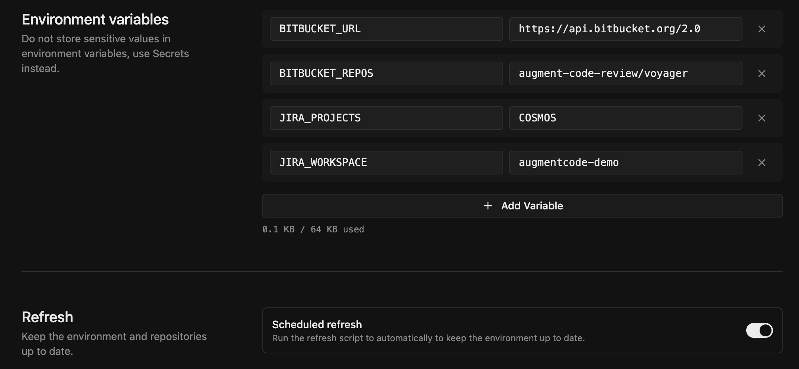

# Auto-clone Bitbucket Repositories in Cosmos

Scripts to automatically clone and update a set of Bitbucket repositories in a Cosmos environment.

## Create `BITBUCKET_TOKEN` secret

An access token is needed to authenticate with Bitbucket over HTTPS to clone the repositories.

Access tokens can be defined on [Repository](https://support.atlassian.com/bitbucket-cloud/docs/create-a-repository-access-token/), [Project](https://support.atlassian.com/bitbucket-cloud/docs/create-a-project-access-token/), or [Workspace](https://support.atlassian.com/bitbucket-cloud/docs/create-a-workspace-access-token/) level. Once created, copy the token, as it will be used in the next step when creating the `BITBUCKET_TOKEN` secret in Cosmos.

When creating the token, specify the following scopes:

* Repositories:
    * `Read`
    * `Write`
* Pull requests:
    * `Read`
    * `Write`

The Pull request scopes are optional, but it's highly recommended to include them so that the token can be used by Experts that need to create pull requests and make comments to existing pull requests.

After creating the token, switch to Cosmos, and go to **Configuration > Secrets > Add Secret > Environment Variable**, and use as Name `BITBUCKET_TOKEN` and as Value copy & paste the token, and click **Create Secret**.

## Create environment

Next, create a custom Cosmos environment that will clone the repositories and keep them up to date.

In Cosmos, go to **Configuration > Environments > Create Environment**, and set the following environment variables:

- `BITBUCKET_URL` (for Cloud use: https://api.bitbucket.org/2.0)
- `BITBUCKET_REPOS` (in the format `<workspace_a>/<repo_x>,<workspace_b>/<repo_y>)
- `JIRA_WORKSPACE`
- `JIRA_PROJECTS` (comma separated)



Then click **Customize**, and follow the steps below.

1. Copy the scripts from this directory into your environment

- `init-repos.sh` — clones each repository listed in `BITBUCKET_REPOS` into `/workspace` (skips repos that already exist).
- `update-repos.sh` — runs `git pull` on each repository listed in `BITBUCKET_REPOS` that already exists under `/workspace`.

2. Make the scripts executable:

   ```bash
   chmod +x init-repos.sh update-repos.sh
   ```

3. Wire the scripts into the Cosmos lifecycle hooks by appending the following lines:

   To `/hooks/on_startup.sh`:

   ```bash
   cd /workspace
   ./init-repos.sh
   ```

   To `/hooks/on_refresh.sh`:

   ```bash
   cd /workspace
   ./update-repos.sh
   ```

After this, `init-repos.sh` will run when the environment starts up and clone any missing repositories, and `update-repos.sh` will run on each refresh to pull the latest changes.

Once you're done, hit **Save & Close**.

Finally, on the Environment page, enable the **Scheduled refresh** toggle.
